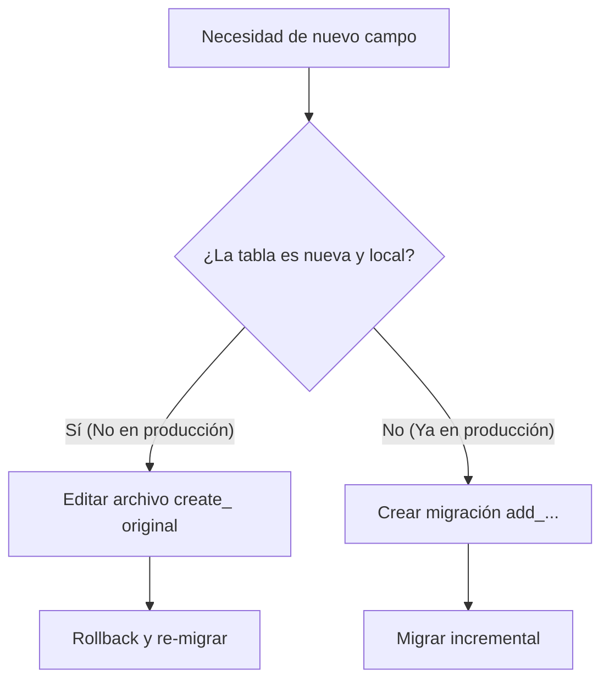

# 💾 Habilidad de Migraciones — Estructura de Base de Datos y Cambios Recientes

Esta habilidad detalla el estándar para la creación, modificación y mantenimiento de las migraciones de base de datos en `Project_saavedra`.

---

## 🛠️ Regla de Oro para Modificación de Tablas

### 1. Tablas Nuevas (No subidas al Servidor de Producción)
Cuando se está desarrollando una característica nueva que introduce una tabla recién creada (y estas migraciones **aún no se han desplegado en el servidor de producción**):
* **NO** crees migraciones adicionales de tipo `add_fields_to_table`.
* **SÍ** edita directamente el archivo de migración original de creación de la tabla (la migración principal `create_table`).
* **Acción**: Haz rollback de la migración afectada, actualiza el esquema original, y vuelve a ejecutar `php artisan migrate`.

### 2. Tablas Antiguas/Existentes (Ya desplegadas en Producción)
Cuando se necesita alterar o añadir campos a una tabla vieja que ya existe y está activa en el entorno de producción:
* **SÍ** crea una nueva migración de tipo alteración (`add_` o `modify_`).
* **Comando**: `php artisan make:migration add_extra_fields_to_nombre_tabla_table --table=nombre_tabla`
* **Acción**: Ejecuta `php artisan migrate` para aplicar de forma incremental sin destruir datos existentes.

---

## 🚦 Proceso de Verificación
Antes de proponer una migración nueva, sigue este flujo de toma de decisiones:

