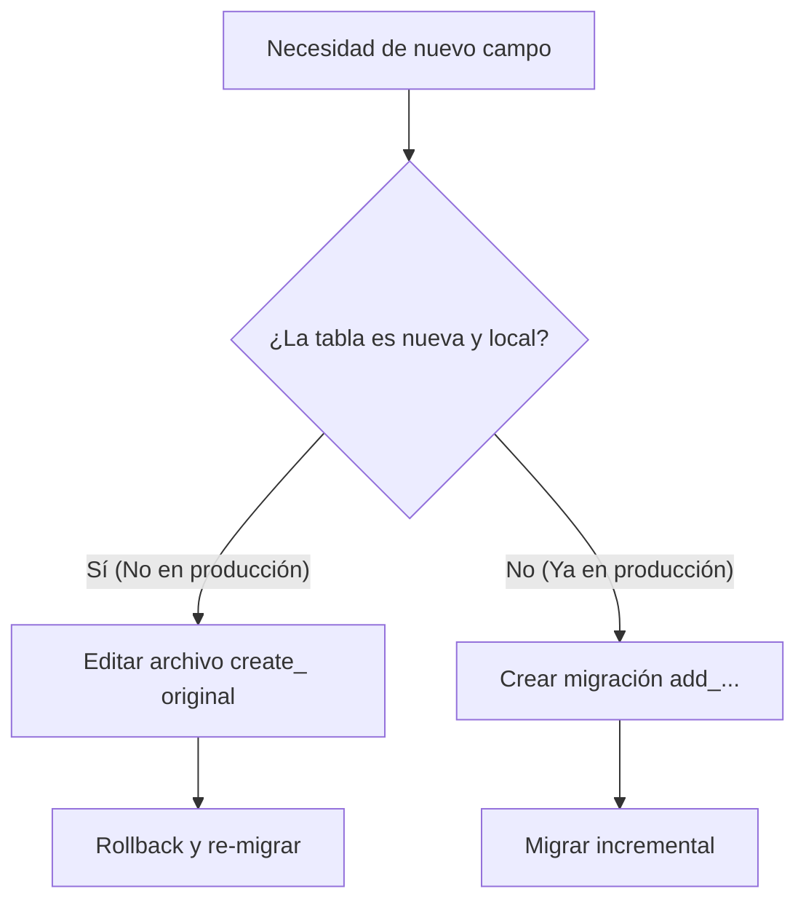

# Habilidad de Migraciones — Estructura de Base de Datos y Cambios Recientes

> ** Directorio de Referencia:** `database/migrations/`
> *Usa los archivos en este directorio como base o inspiración al crear/modificar funcionalidades relacionadas con esta skill.*


Esta habilidad detalla el estándar para la creación, modificación y mantenimiento de las migraciones de base de datos en `Project_saavedra`.

---

## Regla de Oro para Modificación de Tablas

### 1. Tablas Nuevas (No subidas al Servidor de Producción)
Cuando se está desarrollando una característica nueva que introduce una tabla recién creada (y estas migraciones **aún no se han desplegado en el servidor de producción**):
* **NO** crees migraciones adicionales de tipo `add_fields_to_table`.
* **SÍ** edita directamente el archivo de migración original de creación de la tabla (la migración principal `create_table`).
* **Acción**: Haz rollback de la migración afectada, actualiza el esquema original, y vuelve a ejecutar `php artisan migrate`.

### 2. Tablas Antiguas/Existentes (Ya desplegadas en Producción)
Cuando se necesita alterar o añadir campos a una tabla vieja que ya existe y está activa en el entorno de producción:
* **SÍ** crea una nueva migración de tipo alteración (`add_` o `modify_`).
* **Comando**: `php artisan make:migration add_extra_fields_to_nombre_tabla_table --table=nombre_tabla`
* **Acción**: Ejecuta `php artisan migrate` para aplicar de forma incremental sin destruir datos existentes.

---

## Estándares de Estructura e Integridad

### 1. Naming Conventions (Convenciones de Nombres)
- **Tablas:** Siempre en plural y snake_case (Ej: `ordenes_trabajo`, `soldadura_lotes`).
- **Columnas:** Siempre en singular, minúsculas y snake_case (Ej: `peso_kg`, `botes_generados`).
- **Llaves Foráneas:** Siguiendo el estándar de Laravel: `[nombre_singular_tabla_padre]_id` (Ej: `lote_id` para relacionar con `soldadura_lotes`).

### 2. Llaves Foráneas e Índices
Declara las relaciones de manera explícita y con borrado/actualización controlada. Coloca índices en columnas que frecuentemente son parte del `where` de consultas pesadas para optimizar el rendimiento.

```php
Schema::create('soldadura_botes', function (Blueprint $table) {
 $table->id();

 // Llave foránea declarada de forma moderna
 $table->foreignId('lote_id')
 ->constrained('soldadura_lotes')
 ->onDelete('cascade'); // Elimina los botes si el lote es eliminado

 $table->string('matricula')->unique(); // Crea índice unique automático
 $table->string('estado');

 // Índice explícito para búsquedas por estado
 $table->index('estado');

 $table->timestamps();
});
```

### 3. Borrado Suave (Soft Deletes)
Para evitar la pérdida accidental de datos históricos en el sistema de producción, utiliza Soft Deletes en lugar de borrados físicos.

- **En la Migración:**
```php
Schema::table('ordenes_trabajo', function (Blueprint $table) {
 $table->softDeletes(); // Crea la columna 'deleted_at'
});
```

- **En el Modelo Asociado (`Orden_trabajo.php`):**
```php
use Illuminate\Database\Eloquent\SoftDeletes;

class Orden_trabajo extends Model {
 use SoftDeletes;

 protected $dates = ['deleted_at'];
}
```

---

## Proceso de Verificación
Antes de proponer una migración nueva, sigue este flujo de toma de decisiones:



---

## 4. Tablas Principales del Proyecto (Estado Actual)
El proyecto tiene ~31 grupos de migraciones. Las más críticas para el flujo de fundición son:

| Tabla | Uso Principal |
|---|---|
| `fundicion_history` | Estado completo de cada OT de fundición |
| `liberacion_modelos_fundicion` | Decisiones de calidad por clase de modelo |
| `pre_ordenes_fundicion` | Pre-órdenes de reproceso generadas por almacén |
| `scar_modelos` | SCARs (no conformidades) vinculadas a OTs de fundición |
| `fundicion_file_logs` | Log de auditoría de archivos subidos/eliminados en fundición |
| `system_logs` | Log global de auditoría de acciones del sistema |
| `soldadura_lotes` | Lotes de soldadura con botes |
| `soldadura_botes` | Botes individuales dentro de un lote |
| `qrs_generados` | QRs generados para piezas y botes |

### Columnas JSON y Bool Frecuentes en Fundición
Cuando agregues columnas a `fundicion_history`, siempre registra el cast en el modelo:
```php
// En la migración:
$table->json('almacen_archivos')->nullable();
$table->boolean('pre_orden_sent')->default(false);

// En FundicionHistory.php ($casts):
'almacen_archivos' => 'array',
'pre_orden_sent' => 'boolean',
```
